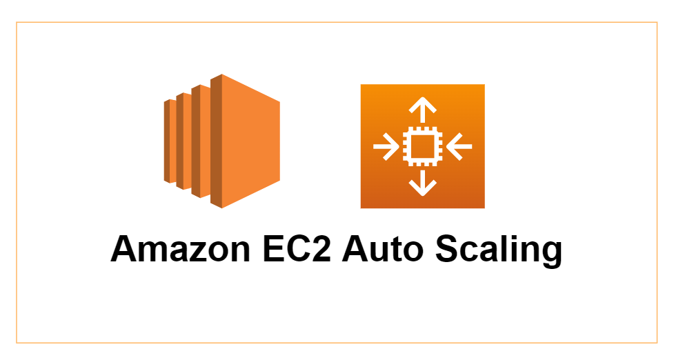
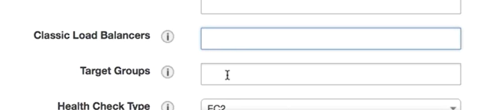

# Amazon EC2 Auto Scaling

# Table of Contents
1. [Introduction](#Introduction)
2. [Using ELB and Auto Scaling together](#using-elb-and-auto-scaling-together)

## Introduction

 

<b>1. What is Amazon EC2 Auto Scaling?</b>

Basically, it's a mechanism that allows you to increase or decrease the amount of EC2 resources to meet the demand based off of custom defined metrics and threshoulds.

<b>2. What does that means?</b>

Let's say that you have a single instance acting as a web server receiving requests from the public users across the internet. As the requests and demands increases, so does the load on the instance, so additional processing power will be required to process the additional requests and, therefore, the CPU utilization will also increase.

To avoid running out of CPU resources on your instance (which would lead to poor performance experienced by your end users), you will need to deploy another EC2 instance to load balance the demand and process the increased requests.

With Auto Scaling you can configure a metric to automatically launch a second instance when the CPU utilization got to 75% on the first instance. This will load balance the traffic evenly, reducing the demand on each instance and reducing the chance of the first web server failing or slowing due to high CPU usage.

You can also set a metric to scale back when the demand reduces along with your CPU utilization. You can configure Auto Scaling to automatically terminate one of your EC2 instances when, for example, your CPU utilization dropped to 20%. In this case, you wouldn't need a second instance due to the decreased demand. Scaling back helps optimize the cost of your EC2 fleet as you only pay for resources when they are running.

<b>3. What are the advantages of using Auto Scaling?</b>

If we were to summarize what was said before, we could list 3 main advantages:
- Automation: infrastruture can elastically provision the required resources, preventing your team to manually have to deploy and remove them.
- Customer Satisfaction: since you'll always be able to provision enough capacity for your environment, it's unlikely that your users will experience performance issues.
- Cost reduction: you can automatically reduce the amount of resources that you have when the demand drops, hence not having to pay for those.

<b>4. What are the components of Auto Scaling?</b>

There's basically 2 main components when configuring an Auto Scaling:

- Launch Configuration or Launch Template: it defines how Auto Scaling Group will build new EC2 instances. You define things like what AMI (Amazon Machine Images), instance types, if you want spot instances, if you need public IP addresses, user data, storage volume and security groups.

- Auto Scaling Group: it defines the desired capacities and other limitations of the group using scaling policies. Also defines where the group should scale resources such as which availability zones

## Using ELB and Auto Scaling together

Suppose you have an ELB configured without an Auto Scaling. You will need to ensure that you manually add or remove targets or instances based on the demand.

This means you need to monitor those demands and add and remove targets and instances as required by yourself.

On the other hand, imagine that you have an Auto Scaling configured but no ELB. How are you supposed to distribute traffic evenly among your instances?

Combining ELB with Auto Scaling helps you manage and automatically scale your EC2 resources both in and out.

- To associate an ALB or NLB, you must associate the auto scaling group with the ELB target group.
- For the CLB, the EC2 fleet will be registered directly with the load balancer

To associate an ELB with your Auto Scaling group, you just need to edit your Auto Scaling group and fill the "Classic Load Balancer or "Target Groups" fields with the ELBs you have already created.

 

