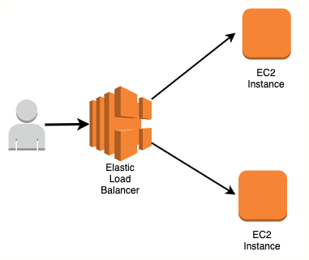
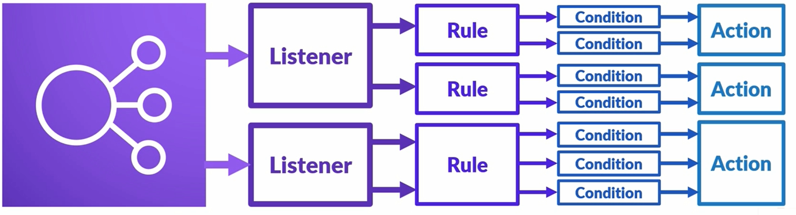

# Elastic Load Balancing

# Table of Contents
1. [Introduction](#Introduction)
2. [ELB ALB - Application Load Balancer](#elb-alb---application-load-balancer)
    1. [Server Certificates (SSL/TLS)](#server-certificates-ssltls)
3. [ELB NLB - Network Load Balancer](#elb-nlb---network-load-balancer)
4. [CLB - Classic Load Balancer](#elb-clb---classic-load-balancer)
5. [Using ELB with Auto Scaling](#using-elb-with-auto-scaling)
6. [References](#references)

## Introduction

 

<b>1. What is ELB?</b>

It's a service that manages and controls the flow of inbound requests destined to a group of targets by distributing these requests evenly across the targeted resource group.

Targets could be EC2 instances, Lambda functions, containers, etc.

Also the targets defined could be situated across different availability zones or all within a single one.

<b>2. What does that means?</b>

Let's imagine a simple scenario where we have a single instance with our application and a group of users. Although it works, this is not a good structure because our instance can fail and the application will be unavailable to the users. Also, if we have a sudden increase in users causing a spike in traffic, we may not be able to handle the additional load.

The best approach is to have more instances and a load balancer. The ELB will receive incoming traffic and redistribute evenly across our instances.

If any of our instances fail, ELB will detect the failure and divert any traffic to the remaining instances.

<b>3. What are the Load Balancer types offered?</b>

- Application Load Balancer: operates at request level
- Network Load Balancer: operates at connection level
- Classic Load Balancer: operates at both request and connection level

<b>4. What are the ELB components?</b>

ELB is basically composed by Listeners, Target Groups, Rules, Health Checks and Nodes
- For each Load balancer, you need to configure at least one Listener. It will define how the inbound connections are routed to a target group based on ports and protocols.
- Target group is a group of resources that will receive the inbound data routed by the load balancer. Each one will be associated with a Listener and a set of rules.
- Rules are associated to each Listener configured within your ELB. They will help define how an incoming request will get routed to which target group based on certain conditions.

A rule can contain 1 or more listeners, a listener can contain one or more rules, each rule contain one or more conditions and ALL conditions in a rule will result in the same action.

 

- Health checks are performed against the resources defined within a target group. It allows the ELB to contact each target with a specific protocol and receive a response.
- Nodes are placed in each Availability Zone selected. These are the ones ELB uses to distribute traffic among our target groups. They have different options:
    - Internet-Facing: the nodes are acessible via the internet, so they have a Public IP in addition to their Private IP, allowing ELB to receive requests from the internet and distribute them among the target groups. 
    - Internal-facing: only private IP, which means the ELB can only serve requests coming from within the VPC
    - Cross-zone LB: an option that, if enabled, can distribute traffic evenly among ELBs in different Availability Zones.

## ELB ALB - Application Load Balancer

- Used when you need a flexible feature set for your web application with HTTP or HTTPS traffic.
- Operates at request level
- Provides advanced routing and visibility features targeted at application architectures, including microservices and containers.

<b>How to create and configure an ALB</b>

1. Create a target group
2. Register a target for the target group
3. Create the Load Balancer
    - Select the ALB
    - Change the listener or add more if you want
    - When configuring routers, select your newly created target group
    - Review and create

If you receive a warning "Your load balancer is not using any security listener", it's because you only defined a HTTP listener. You can go back and define a HTTPS with a server certificate or just ignore it, but be aware that an ALB created this way is vulnerabe and should only be used for testing purposes.

### Server Certificates (SSL/TLS)

When creating your ELB of type ALB (Application Load Balancer), you have the option of creating a Listener using either the HTTP or HTTPS protocol.

> HTTPS is a protocol that creates an encrypted communication channel between the clients and the server. In this case, between the user initiating the request and an ALB.

To allow ALB to receive encrypted communication over HTTPS, you will need to provide a server certificate and an associate security policy.

ALB uses a X.509 certificate, which is a digital ID provisioned by a Certificate Authority (such as ACM - Amazon Certificate Manager). It is used to terminate an encrypted connection received from the remote client, decrypt the request and them forward it to the resources in the target group.

You can select a certificate by Choosing/Uploading one using ACM or IAM. The last one is used in areas where ACM is not supported.

## ELB NLB - Network Load Balancer

The principles are the same as the ALB, but while the ALB works analyzing the HTTP header to redirect traffic, the NLB operates at the Transport Layer (of the OSI model) balancing requests based on TCP/UDP protocols.

You should choose NLB if:
- You need to process millions of requests per second
- You need a static IP address

For the NLB, Cross-Zone load balancing can be enabled or disabled.

The NLB uses an algorithm which uses details such as the TCP sequence, protocol, source port, source IP, destination port and destination IP to select the target in that zone to process the request.

When a TCP connection is stablished with a target host, it will remain open until the duration of the request.

## ELB CLB - Classic Load Balancer

The CLB supports TCP, HTTP and HTTPS (SSL/TLS) protocols. It's recommended to use ALB over CLB unless you have an application running in an EC2-Classic network.

> EC2-Classic: is a platform where your instances run in a single, flat network that you share with other customers. With the creation of VPC, your instances run in a private cloud where that's logically isolated. It's not supported anymore for accounts created after 2013-12-04.

Advantages over ALB:
- Supports EC2-Classic
- Supports TCP and SSL listeners
- Supports sticky sessions using application generated cookies

Also Cross-Zone load balancing can be enabled or disabled.

## Using ELB with Auto Scaling

Please check the Auto Scaling page.

## References

Table of comparison of each Load Balance type:
https://aws.amazon.com/elasticloadbalancing/features/#compare