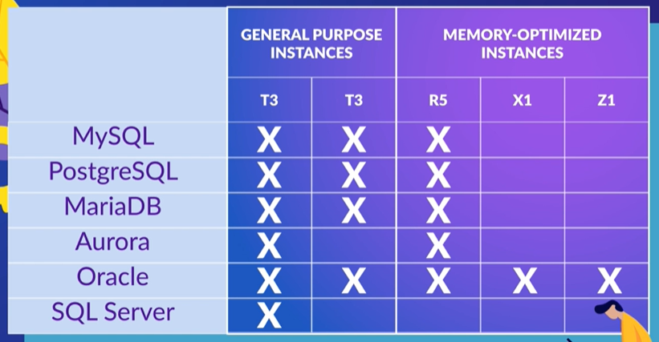

# Amazon Relational Databases

## Introduction

Amazon RDS is a relational database service, it provides a simple way to provision, create and scale a relational database within AWS. Since it's a managed service, administrative operations like backups and patches are managed by AWS.

## Database Engines

The database engines supported are:

- MySQL
- MariaDB
- PostgreSQL
- Amazon Aurora
- Oracle
- SQL Server

## Instance Types

In addition to the database engines, you also have a wide variety of instance types to choose where you'd like to run your database on.

When you create your RDS database, you need to select your isntance depending on how much process power and memory you need. There's basically two categories to choose from:

- General Purpose
- Memory Optimized

The instance classe options are limited by those supported by the database engine your selected.

 

## Multi AZ

You can deploy your database in a single availability zone, but for higher availability and resilience, your might consider Multi AZ (multiple availability zones).

Multi AZ deploys a secondary RDS instance in a different availability zone but in the same region as the primary instance. The purpose of this second instance is to provide a failover option for the first one. Also the data replication happens synchronously.

The failover will happen if the following scenarios happens to the first instance:

- Patching maintenance
- Host failure
- Availability zone fails
- Reboot with failover
- Instance class is modified

## Scaling

In order to ensure that your database is capable of meetinds the demands of load, you might need to increase your storage and computational power.

<b>Storage</b>
To scale storages, there's a feature called autoscaling. All of the engines supported by AWS, with the exception of Aurora DB, use EBS (Elastic Block Storage).

Amazon Aurora uses a shared cluster storage, not EBS. Your database will scale automatically as your database grows.

<b>Computational Power</b>
Just like EC2 instances, you can scale your databases vertically or horizontally.

Vertical scaling means changing the instance for another with better specs, such as more memory of more processing power.

Horizontal scaling means increase the quantity of your instances, creating replicas to help process the operations made to the database, like readings and writings.