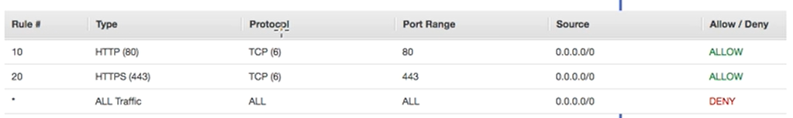
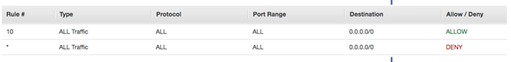

# AWS - Network Access Control Lists

## Introduction

NACLs are virtual network-level firewalls that are associated with each and every subnet. They help control both ingress and egress traffic that are moving in and out of your VPC and between your subnets. It's basically a table where you can define properties such as ports and protocols, and the action (Allow/Deny) it should take when receiveing traffic that matches it.

Just like Route Tables, every subnet is created with a NACL associated to it. By default it will allow all traffic, both inbound and outbound, so it's not much secure. To solve this, we need to make a few changes in its configuration.

## Configuration

Let's imagine a scenario where we have our VPC and a public subnet connected to a Internet Gateway, along with a Route Table and a NACL, and a web server deployed and receiving traffic on HTTP(80) and HTTPS(443). There's already a route configured to allow public communication, but we still need to configure the NACL.

Since it's a web server, we need to allow traffic coming into ports 80 and 443. The table will look like this:

 

This means that any traffic from any source that is going to port 80 and 443 with a TCP protocol is allowed. Everything else is denied.

Then we need to configure the outbound table:

 

This means that any traffic going to any destination is allowed. The second rule is not doing anything because the first one already allows everything.