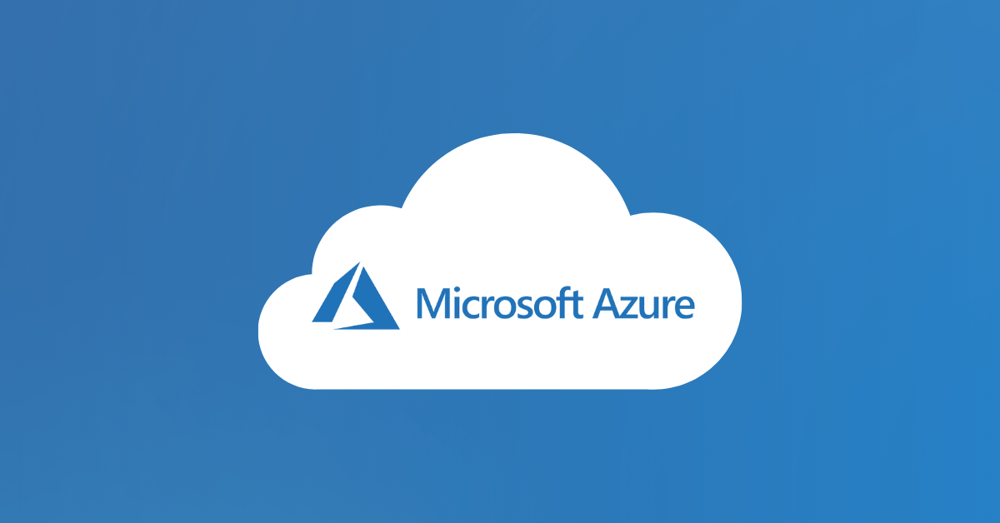

# Microsoft Azure

 

## Introduction

Microsoft Azure is a platform that offers a collection of online services that organizations use to build, host and deliver applications. There is no need for datacenters because Azure runs of Microsoft's own datacenters around the world, where users can access it over the internet

There's also no need to maintain your own infrastructure, and it gives the possibility to scale up and down as needed.

## Core Services

The three core services that Azure provides are:
- Compute
    - [virtual machines](compute/virtual-machines.md)
    - [app service](compute/app-service.md)
    - [containers / kubernetes](compute/containerkubernetes.md)
    - [functions](compute/functions.md)
- Storage
    - blob
    - files/lake
    - databases
- Network
    - vnets
    - subnets
    - vpn
    - express routes