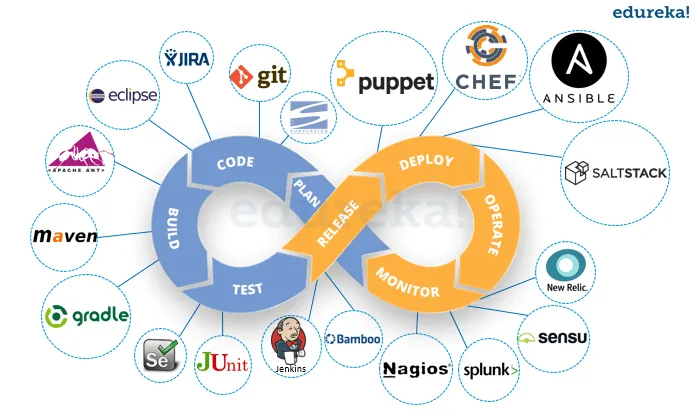
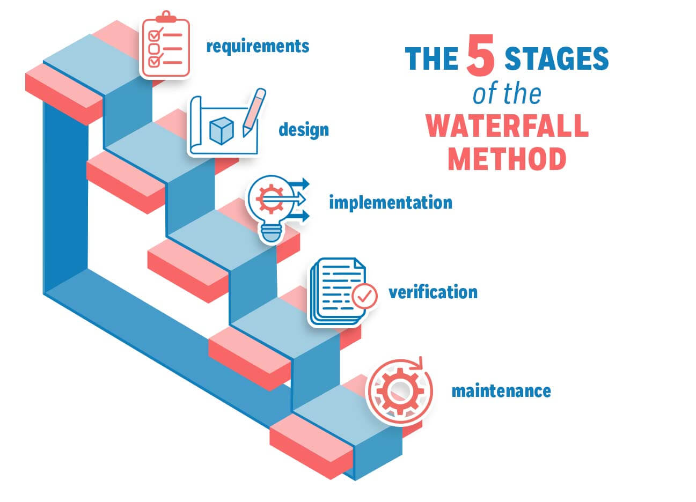
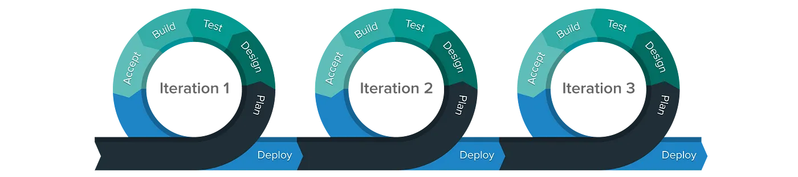

# DevOps Concepts

 

## Table of Contents
1. [What is DevOps](#what-is-devops)
2. [The History of DevOps](#the-history-of-devops)
    1. [Waterfall Methodology](#the-waterfall-methodology)
    1. [Agile Methodologies](#the-agile-methodology)
    1. [DevOps](#devops)
    1. [DevOps x Agile](#devops-x-agile)

## What is DevOps?

The term "DevOps" comes from a combination of the words "Development" and "Operations". It is a practice where a team can manage and improve the entire SDLC (Software Developmento Lifecycle) of a organization.

To be more specific, you utilize tools and practices to help organizations build, test and deploy software more reliably and at a faster rate. It enables organizations to evolve and deliver their products more quickly than those with a traditional development and release cycle.

There's also a culture of collaborations between software developer and IT operations. Those two teams often have conflicting goals:
- The development team wants to implement new features and bugfixes quickly to provide value to the users as soon as possible
- IT operations are more concerned with stability, ensuring that everything is running smoothly and with high availability.

Agility and stability can be contradictory and can lead to a methodology where neither of the teams are happy.

DevOps helps satisfy both of those needs, it provides agility for developers allowing multiple releases in a short period of time, while also implements automated testing and manual reviews, which ensures the operations team that any defective builds fail before landing in a production environment.

## The History of DevOps

To understand how DevOps emerged, we must first understand what were the most popular software development methodologies that existed: traditional methods (like waterfall) and agile methods.

### The Waterfall Methodology
One of the most traditional approaches of software development is called "Waterfall Method".

 

This is a very straight forward and linear model, following a top-down approach. Let's briefly describe each one of those stages:

- Requirements: you get the requirements from the client for developing the application and, later, analyze it.
- Design: you prepare a blueprint of the software, thinking how it's going to look like.
- Implementation: when you start coding the application and theirs various components.
- Verification: you conduct various tests, such as units tests, integration tests, performance, etc. If everything is ok, you proceed with the deployment.
- Maintenance: when the application is monitored.

Although simple to understand and implement, it also brought along lots of risks and challenges. For example:
- you don't have a good visibility of the current progress
- there's a huge waiting time until deployment
- it's very difficult to diagnose issues and provide feedback

With this we can see that it's difficult to make changes if, for instance, the requirements changes. So it's not suitable for large and complex projects.

### The Agile Methodology

 

Agile is a software development approach where the software project is broken into several iterations/sprints. Each iteration will have stages similar to the waterfall method and the duration is usually between 2 and 8 weeks.

The Agile process works like this:
- application is released with some high priority features in the first iteration
- end-users will provide feedback about the performance of the application
- on the following iteration, you make changes based on the feedback received, add bugfixes and new features, and then release it again
- you repeat this process until you achieve the desired quality

The advantages if this methodology is that it's easy to respond do requirement changes, we can fix errors early in the development process and it's suitable for large projects. In general, it improves the quality of the product and reduces drastically the ocurrence of errors.

The disadvantages are that it's highly dependent on clear customer requirements, lacks documentations and increases maintainability risks.

### DevOps

The DevOps movement started some time between 2007 and 2008. A consultant/project manager and agile practitioner called Patrick Debois rose concerns about the separation between the development team and the operations team, along with the inneficiencies that it raises.

I'm not going to cover all those details, but thanks to Patrick, the whole IT community started to discuss methods to improve those processes.

DevOps aimed to fix problems brought by the waterfall methods by targeting product delivery, continuous testing, quality testing, feature development, and maintenance releases in order to improve reliability and security and provide faster development and deployment cycles. This is why it shares so many similarities with the Agile software development movement.

### DevOps x Agile

DevOps are often described as an evolution of Agile practices, but in reality it's more like a missing piece of Agile. It's an effort to take all the innovations of the agile practices and apply them to operational processes.

There are multiple references to continuous delivery in agile documents, but this is difficult to achieve when this raises so many operational concerns. This is why continuous software delivery is usually regarded as a DevOps practice.

In conclusion, DevOps and Agile have the same goals: to improve the speed and quality of softwre development. Nowadays it makes little sense to talk about one without the other.