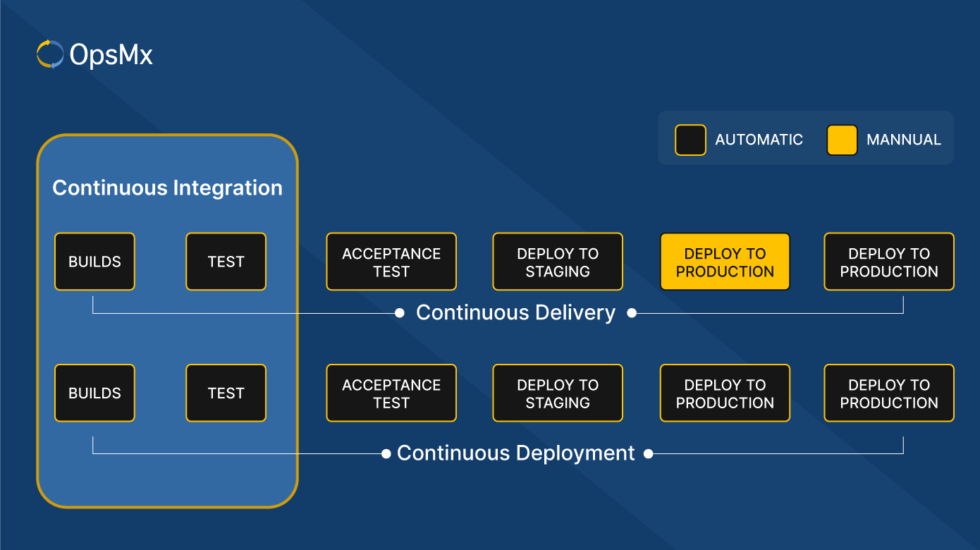

# Continuous Integration / Continuous Delivery (or Deployment)

 

## What is CI/CD?

CICD stands for Continuous Integration / Continuous Delivery (often the last being considered as Deployment, or even Development). It's a concept in the software development process and considered one of the core aspects of DevOps practices.

Companies implements CICD practices to automate tasks in order to be able to delivery software faster and in a more reliable way, minimizing human errors as much as possible.

To understand CICD, first we need to understand all the stages of a software development cicle.

## SDLC - Software Development Lifecycle

Whenever a software is updated, it needs to go through a series of stages before being available for the user to use it. We can generally describe those stages in the following manner:

1. Planning: decide what tasks should be done in this iteration
2. Development: the developers code and implement the feature into the software
3. Testing: with the updated code, we need to run tests to make sure the software is running as intended and nothing broke because of those changes
4. Release: generate an artifact and upload it to a repository
5. Deploy: update the version running in a environment and making it available to the user

## Differences between Continuous Integration, Continuous Delivery and Continuous Deployment

When we talk about Continuous Integration, we are talking about continuously integrate the new code into our code repository, while also running tests to make sure everything is fine. Running builds, merges, integration tests, unit tests, etc.

Continuous Delivery and Continuous Deployment are almost the same, they generate the artifact and upload them to a repository, then later both retrieve the newest version of the software in the repository and knows how to deploy it in a test or production environment. The difference lies in waiting for an approval before doing so or not.
Continuous Delivery leaves everything prepared for deployment, only waiting for someone to manually approve the deployment, while Continuous Deployment automatically deploys the artifact into production.

 

So basically the stages of each one are:

CI
    - Build
    - Unit Tests
    - Integration Tests

CD
    - Release
    - Deploy