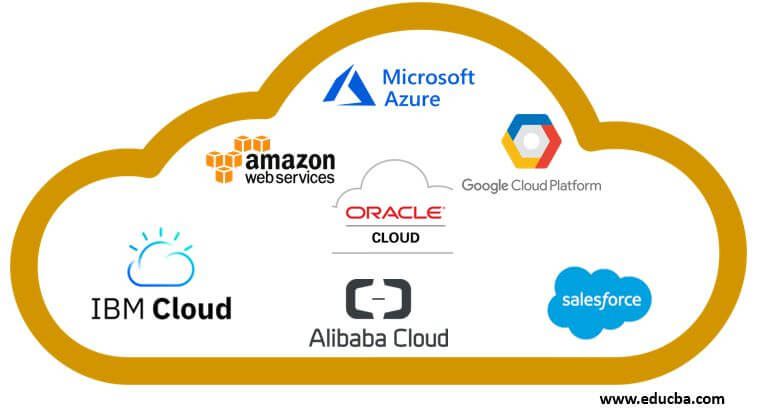

# Cloud Providers

 

## What are Cloud Providers?

Cloud providers are companies that offer cloud-based platform, infrastructure, application and/or storage services. 
They tipically offer various "pay-as-you-go" subscription models. Just like someone would pay for services like eletricity and water services in a house, those companies offers these services and charges only for how much it is being consumed.

The most popular cloud service platforms are Amazon Web Services, Microsoft Azure and Google Cloud Platform.

## Benefits of using Cloud Providers

Using Cloud Providers has benefits and challenges, companies need to considers those factors before making a decision:

Benefits:
    - Cost: the pay-as-you-go model enables organizations to only pay for what they consume. It also eliminates the need to purchase and maintain physical equipments.
    - Scalability: it's easier to scale resources up and down based on demands
    - Mobility: resources and services can be accessed from any physical location, as long as you have an internet connection
    - Disaster Recovery: cloud providers tipically offer quick and reliable disaster recovery

Challenges:
    - Hidden costs: cloud use may often incur expenses not included in an initial investment analysis. Companies using cloud providers need to have additional staff for monitoring and managing cloud use.
    - Migration: moving data to and from the cloud can take time. Usually they provide services to make migration easier, but still it's necessary to have staff that will help with migration.
    - Security: cloud providers follow a shared responsibility model, meaning cloud security is implemented by both the cloud provider and the customer. It's necessary to fully understand each one's responsibility to avoid security riscks or breaches.

## Types of Cloud Providers:

IaaS (Infrastructure as a Service):
    - Providers infrastructure components that you would normally have in a data center, eliminating the need to procure, configure and maintain on your own.
    - This includes: compute, network storage, data management, virtualization and operating systems.
    - Increases flexibility and lower costs, but customers are still responsible for managing and maintaining their own applications and responding to issues.

PaaS (Platform as a Service):
    - Provides tools and services to create and deploy applications.
    - Includes: operating systems, middleware and runtime environments. Also manages hardware and other assets related to the underlying infrastructure

SaaS (Software as a Service):
    - The most familiar in the cloud market. Cloud providers deliver ready-to-use applications and are responsible for maintaining and managing everything, from hardware and maintenance to developing, scaling and delivery.
    - Examples: Gmail, Calendar, Docs, Drive (from Google)
    - Other softwares include: containerization, edge computing, machine learning, etc.