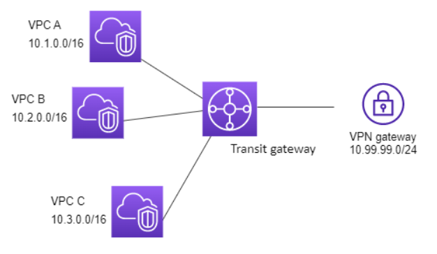

# Amazon VPC Peering

## Introductionb

A VPC Peering is a network connection between two VPCs that enables you to route traffic between them using private IPv4 or IPv6 addresses.

Instances in each VPC can communicate with each other as if they were within the same network. They can be in the same or in different regions.

It's important to mention that the VPC Peering is a 1-to-1 connection. So in case there's three VPCs and you want them all to communicate with each other, you will need to configure a VPC Peering for each pair of VPCs. You can't use a VPC to act as an intermediate to route traffic, for example, from VPC-1 to VPC-3, you need to have a specific VPC Peering connecting VPC-1 to VPC-3 so they can communicate.

Also you can't create a VPC Peering between two VPCs that has matching or overlapping CIDR blocks. For example, you can't connect two VPCs that has the CIDR block 10.0.0.0/16.

## Creating a VPC Peering

To create the VPC Peering, first you need to create a request from one VPC to peer with another VPC, and it needs to be accepted by the that VPC.

Then you need to update both route tables to allow traffic between those instances. Just add a rule saying that traffic destined to the other VPC will have the VPC Peering as target. Something like this:

```
Destination                 Target
the-other-vpc-cidr-block    vpc-peering-id
```

## Transit Gateways

While a VPC Peering is a simple and efficient solution, it's not really suited for complex infrastructure. In a scenario where we have 5 VPCs and 2 local datacenters, it would be really difficult and confusing to create and configure 1-to-1 connections between all those resources.

<p align="center">
 
</p>

Transit Gateways allows you to connect all those infrastructure components, be it VPCs or remote locations, to connect to each other via a central hub that supports all types of connections, be it VPN or Direct Connect. Every infrasstructure component will connect to this Central Hub and it will be able to communicate with every other component connected to this same hub. 

<p align="center">
 
</p>

Another big advantage is related to monitoring, you can have only one dashboard to monitor everything since using Transit Gateways will centralize all your network traffic and connectivity in one place.