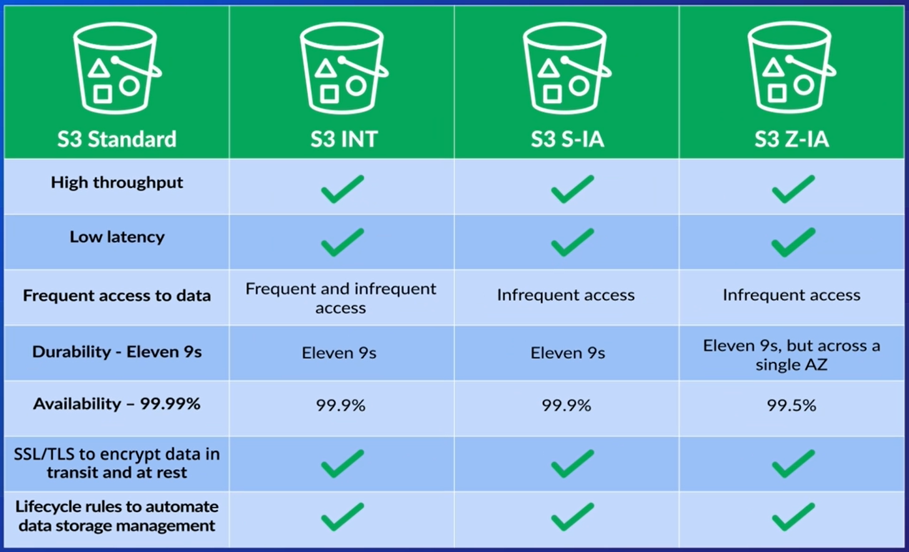
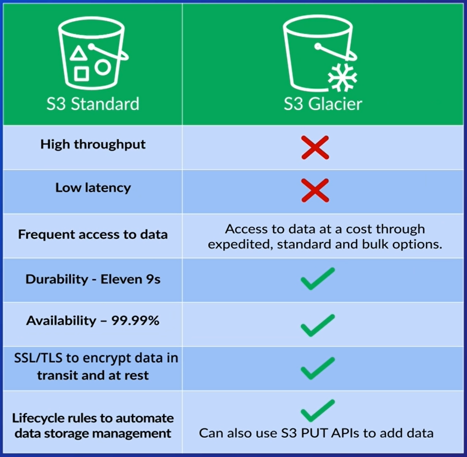

# AWS Simple Storage Service (S3)

# Table of Contents
1. [Introduction](#Introduction)
2. [How to store data?](#how-to-store-data)
3. [Storage Classes](#storage-classes)
    1. [S3 Standard](#s3-standard)
    2. [S3 INT](#s3-int---intelligent-tiering)
    3. [S3 S-IA](#s3-s-ia---standard-infrequent-access)
    4. [S3 Z-IA](#s3-z-ia---one-zone-infrequent-access)
    5. [S3 Glacier](#s3-glacier)
    6. [S3 G-DA](#s3-glacier-g-da-deep-archive) 
4. [How do I know which storage class should I use?](#how-do-i-know-which-storage-class-should-i-use)

## Introduction

Amazon S3 is probably the most used storage service that is provided by AWS, simply because it can be a gret fit for many different use cases, as well as integrating with different AWS services.

It is highly available, highly durable, very cost effective and widely accessible. It is promoted as having unlimited storage capabilities, making AWS S3 extremely scalable.

There are, however, limitation to the size of a single file that it can support: 
- Smallest file size: 0 bytes
- Largest file size: 5 terabytes

<b>Storage type</b>

S3 operates an object file system, which means each object uploaded does not conform to any data structure hierarchy like a file system would. It exists across a flat structure space and is referenced by an unique URL.

<b>Storage location</b>

S3 is a regional service, when uploading data you are required to specify the region for that data to be placed in. S3 will then store and duplicate your data across multiple availability zones within that region.

<b>Availability</b>

AWS ensures that the uptime of Amazon S3 is between 99.5% to 99.99% depending on the storage class.

## How to store data?

First you need to define and create a <b>bucket</b>. Think of it as a container for your data. The name must be unique, not only for the region you have chosen, but globally across all others S3 buckets that exist (this is because of the flat adress space, where you can't have a duplicated name).

By default, your account can have up to 100 buckets, but you can make a request to increase this limit.

Any object uploaded is given an unique key to identify it. You can also create folders to help categorize it for easier data management. It's still <b>not</b> a file system.

## Storage Classes

When you are uploading a file, you will be presented with the option to select which storage classes you want for it.

These storage classes are:
- S3 Standard
- S3 INT (Intelligent Tiering)
- S3 S-IA (Standard Infrequent Access)
- S3 Z-IA (One Zone Infrequent Access)
- S3 Glacier
- S3 G-DA (Glacier Deep Archive)

 

### S3 Standard

It's considered a general purpose storage class. High throughput, low latency and can access your data frequently with 99.99% of availability. Has support to SSL/TLS encryption and has lifecycle rules to automatically move data to another storage class.

> Lifecycles Rules: it's a method to automatically manage the life of your data when stored on S3. You are able to specify certain criterias to automatically move your data from one class to another or delete it from S3. You may want to do this to save costs by moving data to a cheaper storage class after a period of time.

### S3 INT - Intelligent Tiering

This class is ideal for when the frequency of access to the object is unknown. By using this class, it can help optimize your storage costs.

Depending on your data access patterns in the S3 INT, S3 will move it between two different tiers (frequent and infrequent access). These are parts of the INT class itself, and are separate from the existing classes listed earlier.

The first time an object is uploaded to S3 INT, it will be placed in the frequent access tier, which is the more expensive one. If it's not accessed for 30 days, it'll be automatically moved to the infrequent access tier. Once it is accessed again, it'll automatically be moved back to the frequent access tier.

Availability is a little bit lower, standing at 99.9% (if we compare to the 99.99% of S3 Standard), but offers the same durability and also provides support to SSL/TLS encryption and lifecycle rules.

### S3 S-IA - Standard Infrequent Access

This class can be viewed as similar to the S3 INT infrequent access tier, as it is designed for data that does not need to be accessed as frequently as data from the S3 Standard tier, but yet offers high throughput and low latency access like S3 Standard does.

Regarding other characteristics, it's the same as the S3 INT.

### S3 Z-IA - One Zone Infrequent Access

It's also designed to be a storage class where data is unfrequently accessed. The main difference is on their durability, since it only exists across a single availability zone.

This means the objects will be copied across multiple storage location but all within the same availability zone instead of across multiple availability zones.

This results in 20% cost reduction (in comparison to S3 Standard), but it has the lowest availability level which is 99.5%.

### S3 Glacier

 

S3 Glacier is used for archive data. It directly interacts with S3 lifecycle rules, however the fundamental difference is that is costs a fraction of what S3 usually charges when storing the same data. The 'catch' is that is doesn't provides instant access to your data.

Glacier offers an extremely low cost, long term durable storage solution, which is often referred to as <b>cold storage</b>, ideally suited for backups and archival requirements.

When retrieving your data, it can take up to several hours to access it depending on certain criteria. 

The data structure around Glacier ir centered around Vaults and archives, it doesn't use buckets or folders like S3. A Vault is simply a container for Glacier archives and are regional, as such you will be asked to choose one when creating a vault. You can have unlimited amount of archives inside your vault.

Glacier also does not have a graphical user interface. The Glacier dashboard within AWS management Console allows you to create vaults, set data retrieval policies and event notifications.

<b>Moving and retrieving data within Glacier</b>

First you need to create your vaults for your archives. Then you can move data using available APIs or SDKs.

As mentioned before, you can also use the S3 Lifecycle rules to move data automatically from S3 to Glacier.

In terms of retrieving, you will again have to use some form of code (APIs, SDKs, or the AWS CLI). It basically follows this logic:

- Create an archive retrieval job
- Request access to all or just a part of that archive

<b>Retrieval Options</b>

- Expedited: used when you have urgent requirement to retrieve your data. It has to be less than 250MB, and it's available to you in 1 to 5 minutes. It's the most expensive option
- Standard: used to retrieve any archive, no matter their size. The data will be available in 3 to 5 hours. The second most expensive option
- Bulk: is used to retrieve petabytes of data at a time, but it usually takes 5 to 12 hours to be completed. Cheapest option.

### S3 Glacier G-DA (Deep Archive)

The cheapest class, but again it focused on long term storage. It does not offers different retrieval options, as AWS states that the retrieval of the data will be within 12 hours or less.

## How do I know which storage class should I use?

The following questions can help you determine which storage class is best suited for your data:

- How critical is my data?
- Does it requires the highest level of durability?
- How reproducible is that data?
- Can it easily be created if need be?
- How often is the data likely to be accessed?