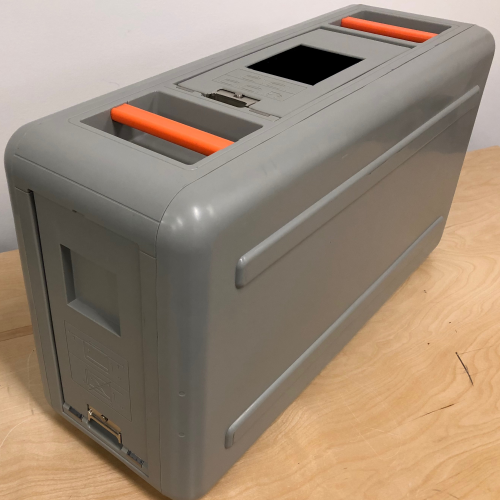

# AWS Snowball

 

## Introduction

Used to securely transfer large amounts of data in and out of AWS (petabyte scale) either from your on-premise datacenter to AWS S3 or from AWS S3 back to your datacenter.

Uses a physical applicance known as Snowball. It comes either as a 50TB or 80TB depending on your region (50TB is currently only available in the US).

## Security

By default, all data transferred to the Snowball device is automatically encrypted using 256-bit encryption keys generated from KMS (Key Management Service).

The device is tracked using an E Ink shipping label. This ensures that the device, after leaving your premises, is sent directly to AWS. You can also enable SNS text messages to track the device or simply use the AWS Management Console.

## Process

- Create an export job from within the AWS Management Console (here you can see the shipping details, S3 bucket, security mechanisms, etc)
- You then will receive your device
- Connect the device to your network:
    - Turn off the device
    - Connect the device
    - Turn on
    - Configure the network settings
- Transfer data:
    - Access the credentials
    - Install Snowball client
    - Transfer data using the client
    - Disconnect after use
- Return the device to AWS using specific shipping carriers