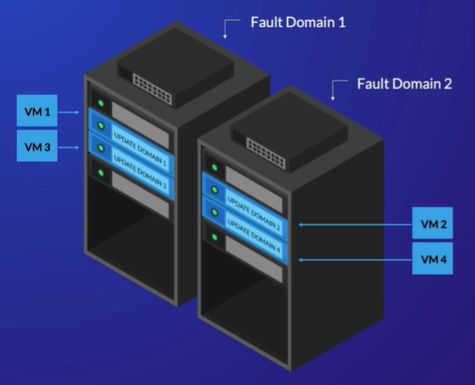

# Microsoft Azure - Virtual Machines

## Introduction

Virtual machines were once the most revolutionary technology, now it's considered standard in every organizations infrastructure. Containers have now taken the spot of revolutionary technology, but VMs are still very important.

VM's gives you full control over not only the software, but also de operating system. This is specially useful when you're migrating existing servers to the cloud.

## High Availability

When you use VM's to run mission-critical applications, you need to architect the solution to make sure it will keep running even if there's a hardware failure, a system update or anything that can cause your services to stop.

Microsoft Azure offers two services to help with high availability:

- Availability Set (although it's not recommended anymore because there's better services offered)
- Availability Zones

## Availability Set

 

It's a group of VM's designed to handle both planned and unplanned downtime.

For planned downtimes, Availability Set groups vms in Update Domains. Azure will only perform updates on one Update Domain at a time, this way VMs in other Update Domains will keep running.

You can configure up to 20 update domains when creating an availability set.

For unplanned downtime, you have groups called Fault Domains. Each one of them have separate power sources and network switches, limiting the downtime caused by hardware failure.

The maximum number of Fault Domains depends on your region, but is usually 2 to a maximum of 3.

Each VM is in both an Update Domain and a Fault Domain, Azure will distribute each VM in those Domains automatically. To qualify for Azure's 99.95% uptime guarantee you need to have at least 2 VMs, 2 Fault Domains and 2 Update Domains.

Although Azure's Availability Sets will give your application a higher rate of availability, it won't protect against a datacenter failure. That's where Availability Zones come in, as an alternative to Availability Sets.

## Availability Zones

Availability Zones are physically separated zones within an Azure region. If one zone goes down, the other will likely stay up. Not every region offers Availability Zones, but the ones that do, there's always three of them.

To take advantage of this, you should deploy multiple replicas of your application's VMs in different Availability Zones. You can specify a particular availability zone when creating each VM.

However even this level of availability rate won't protect you against regional outages. It1s not common, but they can happen, so if you need higher availability you can use multiple regions. 

In most cases, it's sufficient to backup your applications to another regions, so you can use them as temporary replacements in case anything happens. 

When choosing a backup region, you need to be aware of Regional Pairs. Nearly every region is paired with another, some Azure services replicates their data to those paired regions if you choose to do so.

Virtual machines don’t replicate across regional pairs, but you should still consider storing your VM backups in the paired region. Microsoft always try to ensure that at least one region in each pair is available. In the event of a multi regional outage, Microsoft will prioritize the recovery of one region in each pair, so your safest option is to backup in those paired regions.

## Scalability

Scalability is basically increase your resources so you can process more requests and data, for example in case of a spike in demand.

There's two ways of scaling your resouces:
- Vertical scaling
- Horizontal scaling

### Vertical Scaling

The simplest way is to switch a VM to another or a larger size. This means adding more memory, disk storage, etc. Although it's easy, it's also very limited.

### Horizontal Scaling

The more complex way is to create identical replicas of your VM and distribute the requests and data to process equally between them. But to do so, you first need to do a few things:

- your application needs to be stateless
- need to configure a Scale Set

An application being stateless means that it doesn't save data locally. You can use a shared disk and make the application store and read data from there, so any replica will be able to do the same without risking losing data when automatically scaling in (decreasing) the number of VMs.

### Scale Set

A scale set is a group of rules that you define to automatically increase or decrease the amount of VMs. You can create a rule that says to create VMs when the CPU usage gets over 80%, or to decrease when it gets below 30%. You can also add disk or network metrics in your rules.

A Scale Set can have a maximun of 1000 VMs, but if you are using a custom image, the maximum will be 600 per scale set. By default, it's deployed in a single availability zone (zonal scale set), but you can deploy in different availability zones in the same region (regional scale set).