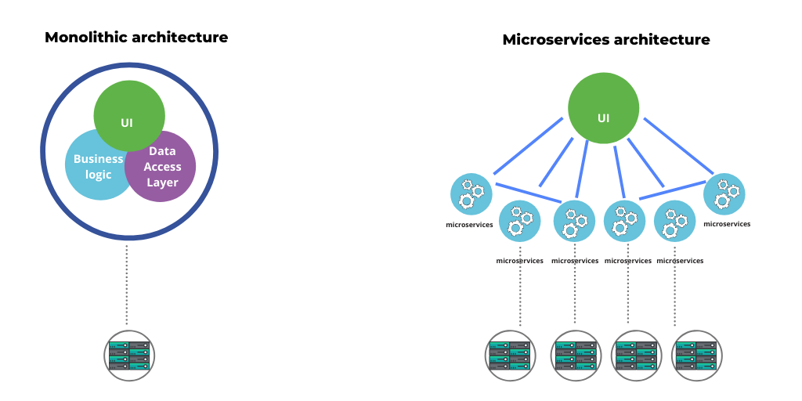

# Microservices

 

## What is a Monolith

The standard way on developing applications was with a Monolithic architecture. This means that all the components of the application, a.k.a the entire code, is part of a single unit.

If we consider an online shop as example, all of its components, such as user authentication, shopping cart, product catalog, notifications, etc, are part of one monolithic application.

Everything is developed, deployed and scaled together. The application must the written in a single language, using the same technology stack, and different teams must be careful as to not affect each other's work.

## What are Microservices

Microservices is an architecture design where you break down a Monolith application in multiple smaller applications.

This comes with a few questions:
- How to break down the application?
- How many services we create?
- How do they communicate with each other?
- How distribute the code?

### A) How to break down the application?

The best practice is to break it down into multiple services (a.k.a. microservices) based of business functionalities, and not technical.

For an online shop, for example, some of those services would be:
- products
- shopping-cart
- user
- checkout
- ...

### B) How many services we create?

Also, each service should have only one responsibility. It's better to have two microservices, one for the shopping-cart and other fot the checkout process, than a single one having to deal with two responsibilities.

Microservices should be self-contained and independent from each other. This means that they must be able to be developed, deployed and scaled separately without any tight dependencies on any other services.

With this, any changes made in service B will not affect any other one. It can be built and deployed separately. This also means that they can have their own independent version.

### C) How do they communicate with each other?

There are 3 most common ways of establishing communication with microservices.
- API calls
- Message Broker
- Service Mesh

<b>API calls:</b> 
Each service has an endpoint that receives requests from other services. This allows them to communicate by sending HTTP requests via those endpoint.
This is considered a SYNCHRONOUS communication, where after sending a requests, the service needs to wait for a response.

<b>Message Broker:</b> 
Services will send messages to each other using another software as an intermediate. This software will store those messages in "queues", processing one by one using FIFO method, and them will forward those messages to their respective service.
Examples of Message Brokers are RabbitMQ, ActiveMQ or IBM Websphere MQ.
This is considered an ASYNCHRONOUS communication, since the service doesn't know when the message will be processed and received by the other end. Adjustments are made in the service in a way that the response will be received later through the Message Broker.

<b>Service Mesh:</b> 
A modern approach, becoming more popular with the popularization of containers and orchestrators like kubernetes, the Service Mesh is a service that takes over the entire communication logic between containers/pods.
With Service Mesh you are basically delegating eveything regarding communication to this service, meaning you don't need to code anything in your application for it to work.

The way it works is by having a "server" that keeps an updated catalog with the adress of each service (pod) automatically. This is possible because every time a pod starts with a containerized service, the Service Mesh detects it and immediately inserts an agent that will keep sending messages to the server. This also means that, if a service changes address or is removed from the cluster, the address catalog will also be updated.

### D) How distribute the code?

There're 2 approaches we can take:
- Monorepo
- Polyrepo

<b>Monorepo:</b> 
You have only one repository for all the services, and you organize it by using one folder for each one.

Since it's still one code repository, this makes the code management and development easier. It simplifies the work by only having to do one clone action, and changes can also be tracked together and released together. It's also easier to share configuration files.

The challenges here is that it becomes more difficult NOT TO break the rule of loose coupling between the services. Especially when you have less experienced members in your team, it's even easier to make such mistakes.

Also, as the project grows in size, any action related to the code repository (clone, push, etc) becomes slower.

When thinking of pipelines in a CICD platform, you need to add some logic to trigger stages only for the services that are receiving an update, or else you will waste resources by building/testing/releasing everything, not only what's really necessary.

<b>Polyrepo:</b> 
For each service you have a different code repository, so even though they are part of the same project, they are treated as if each one is a single project, they are completely isolated from each other.

Some platforms offers a feature of grouping repositories together, such as "Groups" in GitLab. Essentially they are all in the same folder just to make it easier to have a better view of the project.

Regarding pipelines, it's a more straightforward approach, since every service will have their own pipeline, so it's more simple to configure and trigger stages only for those who need it.

The downsides are that it becomes more difficult to make changes that affects two or more services simultaneously.

Searching, testing and debugging is also more complex.

Sharing resources also becomes more complicated. You can duplicate resources, or create single repository where every service reference those configuration files from there.